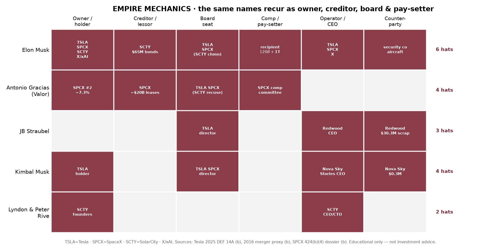

# EMPIRE MECHANICS — the repeatable play (H11 · H12 · H13 · H14 synthesized)

This folds the four graded financial-engineering / reflexivity sub-hypotheses into one picture: a
**single repeatable play**, run by a **small recurring cast** wearing **multiple hats at once**, at
escalating scale — SolarCity→Tesla (2016) as the prototype, Twitter→…→SpaceX (2026) at ~10×.

All four are now **SUPPORTED** against primary filings / regulator record:
- **H11** assemble-by-absorption → `research/H11_solarcity_absorption.md`
- **H12 + H7** debt travels & buys time → `research/H12_H7_debt_chain.md`, `charts/H12_debt_chain.png`
- **H13** closed-loop related-party web → `research/H13_related_party_web.md`
- **H14** sets & broadcasts the price → `research/H14_sets_broadcasts_price.md`

---

## 1. The throughline: same names, many hats

The cast is tiny and the hats overlap. **Elon Musk** is owner, creditor, board, operator,
pay-recipient, and counterparty *simultaneously*. **Antonio Gracias (Valor)** is, at SpaceX alone,
the #2 owner, a ~$20B lessor/creditor, a board member, *and* on the comp committee — and he recused
beside Musk on the 2016 SolarCity vote. **JB Straubel** is a Tesla director *and* CEO of Tesla's
$30.3M scrap counterparty. **Kimbal Musk** sits on Tesla/SpaceX boards *and* runs a Tesla vendor.
The **Rive cousins** founded and ran the distressed company Tesla absorbed.

> When the owner, the lender, the board, and the pay-setter are the *same people*, the guardrails that
> normally protect outside shareholders are standing on both sides of the door (cf. SPCX dossier S3).

## 2. The play, in five moves

1. **ASSEMBLE / ABSORB** a struggling or pre-revenue venture into a larger vehicle you control, via a
   related-party or common-control combination — no open-market price discovery. *(H11)*
2. **RESTATE** the history so the absorbed unit blends into the acquirer; no standalone financials.
   *(H11)*
3. **LEVER WITH TIME-BUYING DEBT** — carry acquisition debt forward, recast it vehicle-to-vehicle, add
   a bridge before the equity event. *(H7 + H12)*
4. **CIRCULATE VALUE INTERNALLY** through a related-party web (sell-to/invest-in/lease-from your own
   entities; directors on multiple sides). *(H13)*
5. **SET + BROADCAST THE PRICE, THEN EXIT** into the bid — own the disclosure channel, set the mark,
   then monetize (sell / list / dilute) into the attention you created. *(H14, + H2/H3/H6)*

## 3. The same play, two cycles

| Move | **Cycle 1 — SolarCity → Tesla (2016)** | **Cycle 2 — Twitter → X → xAI → SpaceX (2025–26)** |
|---|---|---|
| Absorb (H11) | Distressed SolarCity ($768.8M loss, $789.9M burn, ~6mo cash) absorbed all-stock into Tesla | xAI (~$6.35B segment loss) + X absorbed into SpaceX via two common-control combinations |
| Restate (H11) | SolarCity folded into "Tesla Energy" | Histories recast; no standalone xAI / X financials |
| Lever / time (H7·H12) | $2.75B SolarCity debt recast onto Tesla | ~$13B Twitter LBO debt relayed → +$20B bridge → ~$30.3B; IPO repays $18.9B + $1.16B penalty |
| Related-party web (H13) | Musk both sides; cousins run target; insiders hold $65M Solar Bonds + $10M notes; Musk+Gracias recuse | Tesla↔xAI ($191M Megapacks), Valor as owner+lessor+comp-committee, Musk security/aircraft billings |
| Set+broadcast price (H14) | Guidance via @elonmusk; **2013** account designated Reg-FD channel | Founder buys ~$1.42B employee stock → sets $135 mark; owned-channel disclosure; tiered retail pricing |
| Exit / monetize (H2·H3·H6) | (Tesla equity story compounds; later $40B+ in TSLA sales near highs) | Staircase lock-ups; public float <5% → climbs as insiders rotate out |

**Same author, same sequence, ~10× the stage.** The 2016 deal proves the play is not a one-off
improvisation — it predates the SpaceX listing by a decade.

## 4. The regulator has already validated one move

H14 is not merely inferred: the **SEC found, on the record (PR 2018-226)**, that Musk moved Tesla's
price via a channel he owns and Tesla had *designated as official*, charging securities fraud and
imposing $40M + governance reforms. One node of the empire mechanism is an **enforced fact**, not a
thesis.

## 5. What this does and does not claim
- **Does claim:** the *structure* concentrates owner/creditor/board/pay/channel/seller roles in a tiny
  recurring cast, and the same absorb→restate→lever→circulate→broadcast→exit sequence recurs across
  vehicles — all disclosed in primary filings.
- **Does not claim:** intent, fraud (beyond the one adjudicated 2018 disclosure-controls matter), or
  illegality. Filings cannot show intent; the thesis is about *legibility and incentive geometry*, not
  motive.
- **Falsifier for the synthesis:** if the cast did *not* recur across roles, or the five moves did
  *not* repeat across cycles, the "repeatable play" framing would fail. The matrix (§1) and the
  two-cycle table (§3) are the opposite.

## 6. Where it points next (Phase 4)
- Grade the **attention→capital ordering** empirically (`MECHANISM_attention_to_capital.md`): does the
  broadcast→price→sale sequence (move 5) repeat with measurable lags?
- Pull **H9 (pledging)** and **H10 (pay packages)** from proxies to complete the monetization channels.
- Build the **cross-company pattern matrix** that scores each vehicle against the five moves.

*Educational and informational only — not investment advice, not an offer or solicitation.
Money in Motion · Eigenstate Research.*
