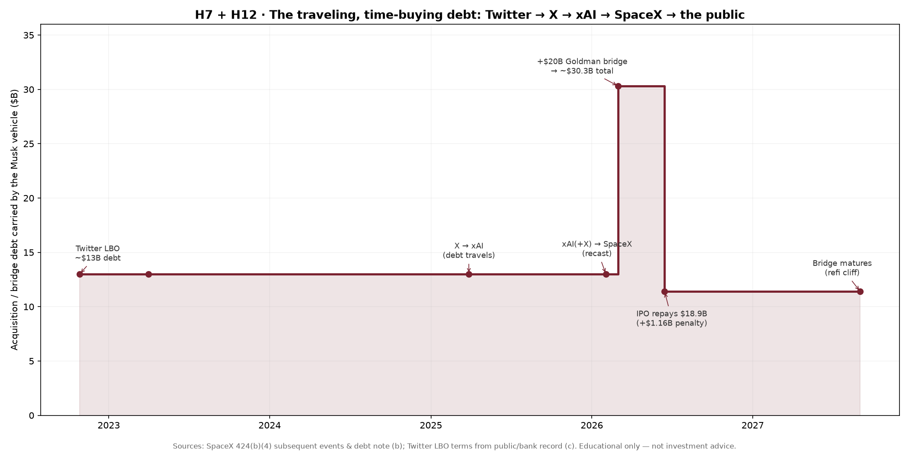

# H7 + H12 — The traveling, time-buying debt chain

**Thesis under test**
- **H7 (debt buys time):** Musk uses borrowed money to hold a position long enough for the equity story to mature, then refinances or sells equity to retire the debt — the lender, not the operator, carries the bridge.
- **H12 (debt travels):** Acquisition debt is not retired where it is created; it is *recast* onto each successive entity through common-control combinations until it can be handed to public-market capital.

**Status: SUPPORTED (mechanism documented end-to-end).** Provenance: `b` = primary filing; `c` = public/bank record; `a` = our connective reading.

---

## 1. The relay, leg by leg

| Date | Entity holding the debt | Event | Debt outstanding | Basis |
|---|---|---|---|---|
| 2022-10-27 | **Twitter** | Leveraged buyout closes; ~$13B acquisition debt loaded onto the target | ~$13.0B | `c` |
| 2023 | **X** | Twitter renamed X; banks could not syndicate the loans and held them | ~$13.0B | `c` |
| 2025-03-28 | **xAI** | X folded into X.AI Holdings (xAI); debt rides along | ~$13.0B | `b` |
| 2026-02-02 | **SpaceX** | xAI (with X inside it) folded into SpaceX; debt recast a second time | ~$13.0B | `b` |
| 2026-03-02 | **SpaceX** | ~$20B Goldman Sachs bridge loan added → total ~$30.3B | ~$30.3B | `b`/`c` |
| 2026-06-15 | **SpaceX → public** | IPO repays $18.9B of the inherited X/xAI debt **+ $1.16B prepayment penalty** | ~$11.4B | `b` |
| 2027-09-02 | **SpaceX** | Bridge maturity — the single largest near-term deadline | ~$11.4B | `b` |

The debt that was created to take **Twitter** private in 2022 is the *same liability* the **SpaceX** public shareholder helped retire in 2026. It never touched a rocket. It changed corporate hosts three times (Twitter → X → xAI → SpaceX) without ever being paid down, then was partially extinguished with IPO proceeds.

## 2. Why this supports H7 (debt buys time)

- The loans were **bridge/hold financing**, not productive capital. For ~3.5 years the debt simply *waited* on a bank balance sheet while the equity narrative (X → "everything app" → xAI/Grok → "AI + rockets") was assembled.
- The **$1.16B prepayment penalty** is the price of having used debt to buy time: the public's IPO dollars paid not only the principal but a premium for early exit. A dollar spent on a penalty builds nothing.
- The **$20B Goldman bridge** added *right before* the listing is textbook leg-three financing: borrow to clear the runway, then list into the bid to repay the borrowing. Goldman is **lender, IPO underwriter, and holder of registration rights** — it stands in every doorway of the refinance (cross-ref SPCX dossier, S5).

## 3. Why this supports H12 (debt travels via common control)

- Two **common-control combinations** (X→xAI, xAI→SpaceX) moved the liability without a market-priced transaction. Because the same person controls both sides, accounting recasts the histories as if always combined — so the debt simply *reappears* on the next, larger, more credible balance sheet.
- Each recast improved the debt's optics: a $13B loan looks existential on Twitter's cash flows, ordinary on a ~$2.4T rocket company with a profitable Starlink engine. **The combination launders the riskiness of the debt, not its size.**

## 4. The same move, one cycle earlier (SolarCity → Tesla)

H12 is not a one-off. In 2016, **$2.75B of SolarCity debt** (see `H11_solarcity_absorption.md`) was recast onto Tesla's balance sheet via an all-stock, related-party merger — debt created at a distressed entity, absorbed by a larger public one Musk also controlled. Twitter→SpaceX is the same pattern at 10× scale.

## 5. Falsifiers (what would break H7/H12)

- If the SpaceX IPO use-of-proceeds had shown the cash going to capex (rockets/satellites/GPUs) rather than debt repayment → H7 weakened. **Not what happened** (subsequent-events note: bridge/inherited-debt repayment).
- If the Twitter debt had been *paid down* at X or xAI from operating cash rather than carried → H12 weakened. **Not what happened** (debt carried flat, then recast).
- If the combinations had been arm's-length acquisitions with independent price discovery → H12 weakened. **Not what happened** (common-control, no standalone financials).

## 6. Open data gaps

- Exact dated balances *between* legs (2023–2025) are `c` (press/bank record); the filing does not print a continuous schedule. The $13B is held flat as a conservative carry.
- The split of the ~$30.3B between residual inherited debt and the fresh bridge at IPO is approximate; the 424(b)(4) does not publish a line-item use of proceeds (labeled `a` where inferred).

**One line:** the public did not fund a frontier — to the extent the IPO repaid this chain, it funded the *exit of a four-year-old buyout's lenders*, plus a penalty, on debt that had been quietly relayed onto a rocket company.
