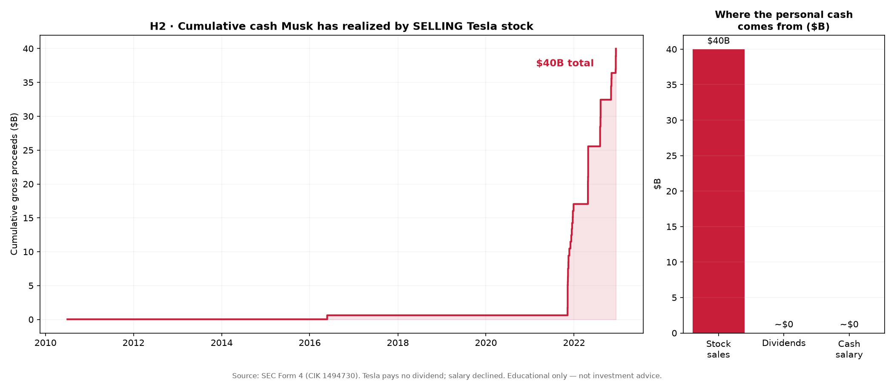
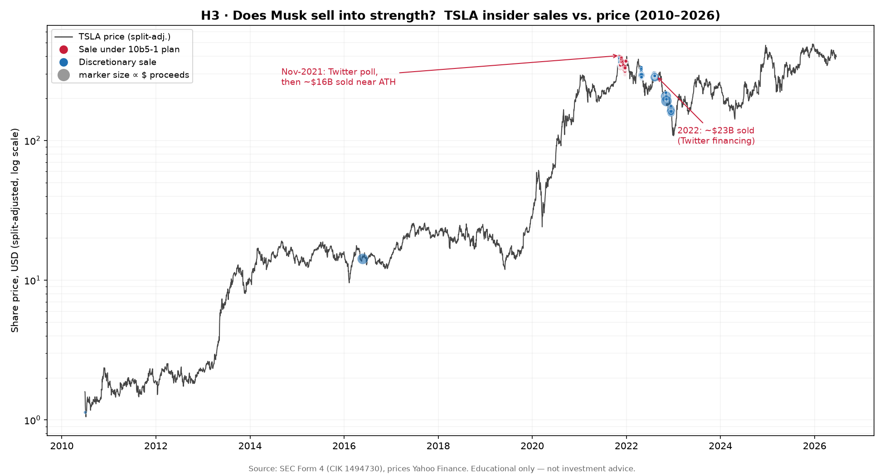

# Phase 3 Findings — Grading H2 and H3 (Tesla, 2010–2026)

First empirical grading pass. We join the parsed Form 4 ledger (`data/transactions.csv`,
CIK 1494730) to split-adjusted daily TSLA prices (Yahoo Finance) to test two
sub-hypotheses. **Provenance:** sale data `b` (filings); prices `m` (market);
percentile statistics `a` (derived). **Educational only — not investment advice.**

> Method note: Form 4 prices are *as-traded* (nominal); Yahoo closes are *split-adjusted*.
> We normalized everything to today's basis using the known TSLA splits (5:1 eff.
> 2020-08-31, 3:1 eff. 2022-08-25). Gross proceeds (shares × price) are split-invariant,
> so the dollar totals do not depend on this adjustment.

---

## H2 — "The payday is the share sale, not operating cash" → **STRONGLY SUPPORTED**

**Counter first.** Selling concentrated stock to diversify is normal and prudent, and a
founder declining salary while taking equity is a pro-shareholder signal, not a red flag.

**Finding.** Across 2010–2026, Musk realized **~$39.98B in gross cash from *selling*
Tesla stock**, against **$0 in dividends** (Tesla pays none) and **~$0 cash salary**
(declined; minimum wage accrued, untaken). The personal-cash picture is essentially
one-sided: the channel through which he converts Tesla into spendable cash is **selling
shares to the market**, not the company paying its owners.



Note also the *shape*: the curve is flat for a decade, then near-vertical in 2021–2022 —
~$40B realized in roughly 14 months. The payday is recent, concentrated, and entirely
sale-driven.

---

## H3 — "He sells into strength, pre-arranged" → **SUPPORTED, WITH AN IMPORTANT NUANCE**

**Counter first.** The largest sales (2022) had a concrete exogenous trigger — funding the
Twitter acquisition — and the 2021 option-exercise sales were forced by a 2012 award set
to expire in 2022. Both are real reasons unrelated to "timing the top." 10b5-1 is a legal
safe harbor designed to be used.

**Finding (the data splits cleanly into two waves):**

| Metric (proceeds-weighted unless noted) | Value | Reading |
|---|---|---|
| Mean trailing-1y price percentile of sales (by count) | **79.0%** | by count, sales skew to the upper end of the prior year |
| Median trailing-1y percentile (by $) | **58.9%** | by dollars, more moderate — dragged down by 2022 |
| Median sale price ÷ prior all-time-high (by $) | **72.8%** | sells near, but not at, the peak |
| Share of $ sold at ≥80th percentile of trailing year | **41.1%** | a large minority sold into clear strength |

- **The 2021 wave (~$16.4B)** clusters **near the all-time high** and was substantially
  **pre-programmed**: the Form 4s state the sales ran under a **Rule 10b5-1 plan adopted
  September 14, 2021** — `b`, verbatim from accession 0000899243-21-044060. The famous
  **"Should I sell 10%?" Twitter poll was November 6, 2021** — *~7.5 weeks after the plan
  was already in place.* The poll framed as a public referendum a sale that was already
  scheduled.
- **The 2022 wave (~$22.9B)** occurred **on the way *down*** from the peak, consistent
  with the exogenous Twitter-financing trigger. This is the honest counter-evidence to a
  pure "always sells the top" story, and we show it rather than hide it.



**Verdict.** H3 holds in its precise form — sales skew into strength and the headline 2021
wave was pre-arranged before its own narrative catalyst — but it is **not** a clean "sells
the exact top" story. The dollar-weighted timing is moderate because the biggest single
wave was event-driven. *That nuance is itself a finding:* the narrative catalyst (the
poll) sat on top of a pre-existing plan, while the largest sales tracked a deal deadline.

---

## What this does to the thesis so far

- **P3 (wealth/risk transfer):** the *realization* leg is confirmed — his Tesla cash is
  sale-sourced (H2). The *who-inherits* leg is still Phase 4.
- **P1 (reflexivity):** the Sept-14-plan-before-Nov-6-poll sequence is a concrete instance
  of narrative (the poll) wrapped around a pre-set monetization — supports H4's direction,
  to be built out with a full event timeline.
- **Still open / caveats:** 10b5-1 plan-adoption dates should be parsed for *every* sale
  (we verified 2021; Phase 4 should extract the footnote dates systematically). The
  10b5-1 *flag* covers $10.6B (27%) of proceeds by explicit footnote language; the true
  pre-planned share may differ once all adoption dates are parsed.

---

## The career timeline — "moving through companies" + net worth at specific dates

Two figures put the whole arc on one page.

**The Journey** (`charts/JOURNEY_companies.png`) — every venture as a bar from founding to
exit/today, with dated markers (founded / IPO / acquisition / exit / key event): Zip2 →
X.com/PayPal → SpaceX → Tesla → SolarCity → OpenAI → Neuralink/Boring → Twitter/X → xAI.

**The Climb** (`charts/CLIMB_networth.png`) — net worth over time, decomposed into
**traceable parts**: Tesla stake (filings × price, `b`/`m`) + SpaceX stake (his econ % ×
round valuation, `c`) + cumulative realized cash (`b`). Net worth at specific dates
(computed proxy, validated against published figures):

| Date | Net worth | Tesla | SpaceX | Realized cash |
|---|---|---|---|---|
| Dec 2012 | ~$2B | $1B | $1B | $0B |
| Dec 2016 | ~$12B | $5B | $6B | $1B |
| Dec 2020 | ~$121B | $99B | $22B | $1B |
| Nov 2021 | ~$251B | $206B | $44B | $1B |
| Dec 2022 | ~$184B | $93B | $55B | $36B |
| Dec 2024 | ~$329B | $142B | $147B | $40B |
| Jun 2026 | ~$358B (→ **~$1.0T** at SPCX IPO) | $171B | $147B (→ ~$870B) | $40B |

**The punchline for the thesis (reinforces H2 visually):** of his net worth, only the thin
gold band — **~$40B, and it stops growing after 2022** — is *realized cash*. Everything else
is **unrealized stock** in two companies he controls. Paper wealth dwarfs cash-in-hand, and
at the SpaceX IPO the paper figure leaps again (his ~36% reprices to ~$870B at the $2.4T
listing). The wealth is real on paper; the cash he has actually extracted is a small slice
of it — which is exactly why *the exit (selling shares) is the event that matters.*

Reproduce: `python3 build/networth_timeline.py` (reads `data/tesla_holdings_anchors.csv`,
`data/spacex_valuations.csv`, `registry/career_events.csv`).

---

## Reproduce

```bash
python3 build/phase3_analyze.py   # reads data/transactions.csv + data/prices_tsla.csv
                                  # writes charts/H2_*.png and charts/H3_*.png + prints stats
```
Prices were pulled from Yahoo's chart API into `data/prices_tsla.csv` (date, close, adjclose).

*Money in Motion · Eigenstate Research · Kirandeep Kaur, Watts Advisor. Educational only — not investment advice.*
